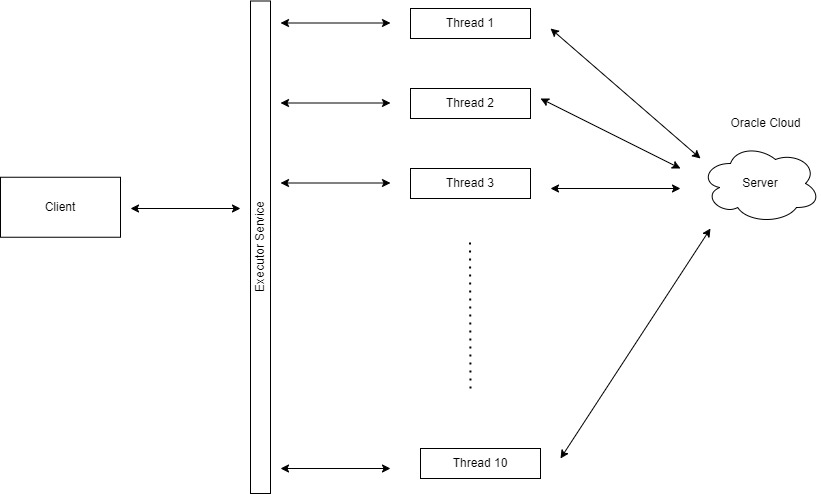
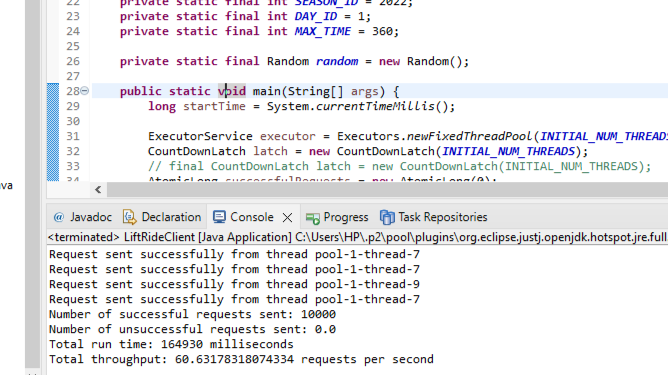
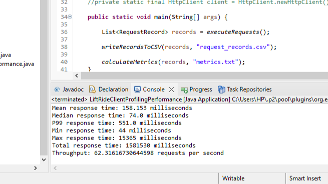

## INTRODUCTION
This project revolves around crafting an advanced clientserver application aimed at evaluating the performance odistributed systems under different workloads. At its core, the project employs multi-threading within the client application to mimic real-world distributed systems, allowing us to assess how well they handle concurrent tasks. Beyond just testing server capabilities, the project delves into the intricacies of developing highly concurrent distributed systems. Through this endeavor, our goal is to gain insights into the challenges inherent in these systems, especially in the context of evolving technology landscapes and growing networks of interconnected devices. By understanding the importance of performance evaluation in distributed systems, we aim to underscore the pivotal role of concurrency and effective resource management in building resilient and scalable architectures.

## GOALS AND OBJECTIVES
The overarching goal of this project is to gain insights into the behavior and performance characteristics of distributed systems under varying loads and concurrency levels. By conducting thorough performance evaluations, we aim to identify potential bottlenecks, scalability limits, and areas for optimization within the distributed architecture. Objectives include measuring the system’s performance through metrics such as response times (mean, median, p99), throughput, and its capability to efficiently manage concurrent requests across the distributed systems. Additionally, the project seeks to establish best practices for designing and deploying distributed systems that can effectively handle high levels of concurrency while maintaining responsiveness and reliability. Through a combination of rigorous testing and analysis, our objectives include not only quantifying system performance but also fostering a deeper understanding of the complex interactions and trade-offs inherent in distributed system design. Ultimately, we aspire to contribute to the development of robust and resilient distributed systems that can meet the demands of modern applications and services in today’s interconnected world.

## METHODOLOGY
The methodology revolves around implementing a robust multi-threaded client capable of generating concurrent HTTP requests to the distributed system. This involves several key steps:

Thread Management: 

The client application is designed with a focus on concurrency, leveraging threads to concurrently send and handle multiple HTTP requests. Thread management tools such as Executors Service are employed to efficiently utilize system resources and ensure smooth execution of concurrent tasks.

Performance Metrics Calculation: 

Integral to the methodology is the integration of functionalities to calculate essential performance metrics based on the data collected from the distributed system. These metrics include response times (mean, median, p99), throughput, and other relevant indicators of system performance. By accurately measuring these metrics, the methodology aims to provide insights into the distributed system’s responsiveness, scalability, and efficiency under varying workloads.

Concurrency Scaling: 

A key aspect of the methodology involves experimenting with different levels of concurrency to understand its impact on the performance of the distributed system. By varying the number of concurrent threads and observing how the system responds under different loads, the methodology seeks to identify optimal concurrency levels and potential bottlenecks that may
affect system performance. Through systematic experimentation and analysis, the methodology aims to gain a deeper understanding of how concurrency scaling affects the overall behavior and efficiency of the distributed system.

## PROJECT DESCRIPTION
The client, developed specifically for this project, not only sends HTTP requests but also records the timing of each  request to calculate performance metrics. It leverages multithreading to simulate multiple users interacting with the server concurrently, which is crucial for assessing the server’s capability to manage simultaneous connections. The figure below shows the Activity Diagram of our project.

Client: 

At the core of the methodology is the client application, responsible for generating and sending HTTP requests to the server hosted on the Oracle Cloud. The client application is designed to be multi-threaded, allowing for concurrent execution of multiple threads, each responsible for sending HTTP requests to the server.

Executor Service: 

To manage the concurrent execution of multiple threads within the client application, an Executor Service is utilized. The Executor Service provides a highlevel interface for managing thread execution, allowing for efficient utilization of system resources and simplifying the management of concurrent tasks.

Multiple Threads Each Sending HTTP Requests: 

Within the client application, multiple threads are instantiated and managed by the Executor Service. Each thread is responsible for sending HTTP requests to the server independently, simulating a high degree of concurrency and mimicking real-world distributed systems’ behavior.

Cloud where the Server Resides: 

The server, where the distributed system is hosted, resides on a Cloud platform. It serves as the target endpoint for the HTTP requests generated by the client application.
The server is configured to handle incoming requests, process them accordingly, and generate responses back to the client.

## PROJECT STRUCTURE
The project comprises two main components: the server-side implementation and the client-side application. The server, deployed on a Cloud utilizing Spring Boot, handles lift ride data received via a RESTful API endpoint. It employs MongoDB to store and manage the data efficiently. On the client side, a multithreaded Java application is developed to simulate various loads on the server. Utilizing Java’s HTTP client classes, the client generates and sends lift-ride data to the server. The client application employs multiple threads to
enhance throughput, with a dedicated thread for generating lift ride events. Through this structured approach, the project facilitates efficient communication and data processing between the server and client components, laying the foundation for scalable and robust digitalization of the ski industry.

## OUTPUT
Little’s Law helps us understand the relationship between throughput, concurrency (the number of requests being processed at any time), and latency (the time it takes to process
a request). We started by running 500 requests in a single thread and using Little’s Law, we calculated the throughput for the single thread, and then, in scaling the throughput by
the number of intended multiple threads, we were able to arrive an estimated throughput for the main client operation. Throughput in the context of our code, throughput is essentially the rate at which the system processes requests, measured in requests per second. According to Little’s Law,
we have:

L = λW

L is the average number of requests in the system ,

λ is the arrival rate (requests per second), and

W is the average time a request spends (seconds).

Rearranging Little’s Law to solve for throughput: λ, which represents throughput here, we get:

λ = L/W

This equation tells us that throughput (λ) is directly proportional to the concurrency (L) and inversely proportional to the latency (W). It means that for a given level of concurrency, reducing latency will increase throughput, and vice versa.

Therefore, in our code, we calculated the throughput using Little’s Law as follows:

Total time (ms) = End time (ms) – Start time (ms);

To convert from milliseconds to seconds

Total time (s) = Total time (ms) / 1000.0;

The average time for a single request (W) in seconds = Total time (s) / No of successful requests;

The arrival rate (λ) in requests per second = No of successful requests / total time (s);

The average number of requests in the system (L) = The arrival rate (λ) in requests per second * The average time for a single request (W) in seconds;

Hence after running the LiftRideClientLittleLawTest Class, we got the following values:

W = 0.16008695652173913 seconds

L = 0.9999999999999999

λ = 6.246605105920695 requests per second

Therefore, the estimated throughput using the number of threads we used which is 10, becomes Estimated throughput = 62.466 requests per second.

Similarly, after running the main client class LiftRideClient as shown in the figures above, the actual throughput is 60.63178 requests per second. Which is close to the estimated throughput 62.466 requests per second.

## CONCLUSION
This project has provided valuable insights into the performance evaluation of distributed systems through the development and execution of a sophisticated client-server application.
The project aimed to benchmark the server’s responsiveness and scalability under varying loads, simulating real-world
distributed system scenarios. Through the implementation of multi-threading in the client application, the project successfully achieved a high degree of concurrency, allowing for the simulation of multiple users interacting with the server simultaneously. This approach enabled the systematic assessment of the server’s ability to
handle concurrent requests efficiently, providing crucial data for performance analysis.
The project systematically evaluated the distributed system’s performance using key metrics such as response times, throughput, and concurrency scaling. By collecting and analyzing performance data, the project uncovered valuable insights into the system’s responsiveness, scalability, and resource utilization under different workload conditions.
Furthermore, the project demonstrated the importance of concurrency and efficient resource management in the design and architecture of resilient and scalable distributed systems.
By pushing the boundaries of performance evaluation, the project highlighted the practical challenges and considerations involved in developing highly concurrent distributed systems.

In summary, this project has demonstrated our understanding of distributed systems’ performance in the face of evolving technology landscapes and increasingly demanding network
environments. The insights gained from this project can inform decision-making processes and optimization strategies for developing robust, scalable, and efficient distributed systems in
various real-world applications.
